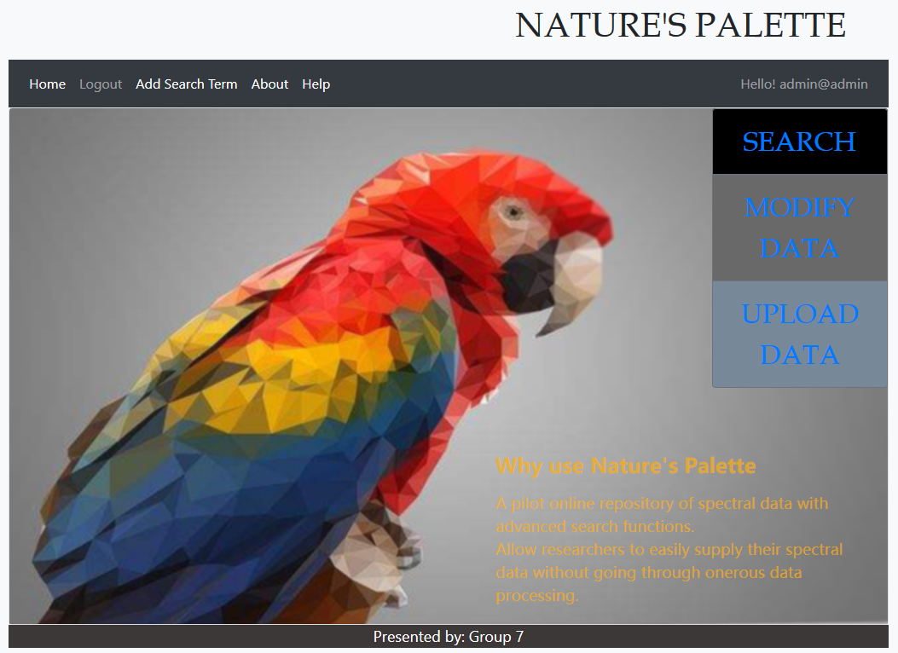

# Nature's Palette

An open-access digital repository of spectral data with advanced search functions. It allows researchers to easily supply their spectral data without going through onerous data processing which is a major barrier to data sharing.


## Getting Started

These instructions will get you a copy of the project up and running on your local machine for development and testing purposes. See deployment for notes on how to deploy the project on a live system.

### Prerequisites

1. Install Node.js.
2. Install MongoDB.
3. Connect to MongoDB, create the following two collections in database 'Palette'.

    ```
   > use Palette
   switched to db Palette
   > db.searchterms.insertMany([{
       "name": "institutionCode"
   }, {
       "name": "collectionCode"
   }, {
       "name": "catalogueNumber"
   }, {
       "name": "class"
   }, {
       "name": "order"
   }, {
       "name": "family"
   }, {
       "name": "genus"
   }, {
       "name": "specificEpithet"
   }, {
       "name": "infraspecificEpithet"
   }, {
       "name": "sex"
   }, {
       "name": "lifeStage"
   }, {
       "name": "country"
   }, {
       "name": "Patch"
   }]);
   > db.usergroups.insertMany([{
       "name": "Researchers",
       "updateSearchTerm": false,
       "uploadFiles": true
   }, {
       "name": "Administrator",
       "updateSearchTerm": true,
       "uploadFiles": true
   }]);
    ```
4. Install R language.
5. Open R language command line, and run the following command to install dependencies.
    ```
   > install.packages(c("pavo", "rjson"))
    ```
6. Use npm to install dependencies.
    ```
   $ npm install
    ```
### Configuration

Create config.js just like config_sample.js, and change its values according to your own needs.

### Running the project
Run the file bin/www using Node.js under your project directory.

```
$ node bin/www
```

### Test

Use a browser to access the running website: http://localhost:3337/

## Authors

* **Tao Liu**
* **Shuaishuai Li**
* **Nanzatov Aiur**
* **Jingyao Li**

See also the list of [contributors](https://github.com/taol-assignments/npp/graphs/contributors) who participated in this project.

